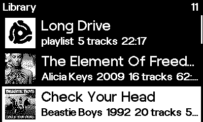
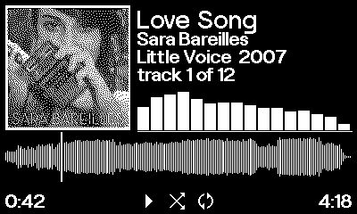

<div align="center">

<picture>
  <source media="(prefers-color-scheme: dark)" srcset="docs/logo-dark.png">
  <source media="(prefers-color-scheme: light)" srcset="docs/logo-light.png">
  
</picture>

<p>
  
  
  
  
</p>

</div>

An album-first music player for the Playdate. A listening object rather than a
pocket player.

The Playdate's screen has to stay on for audio to keep playing, so the display
is not a cost to be minimized here. It is the point. Spindle is meant to sit on
a desk or a nightstand showing something worth looking at while a record plays,
with the crank as a control you reach for rather than a novelty.

Music is prepared on a Mac by an ingest tool that converts audio to ADPCM,
dithers album art to 1-bit, and precomputes the spectrum and beat data the
visualizers run on. The device reads a single index at startup and does no
scanning of its own.

[DESIGN.md](DESIGN.md) has the hardware measurements this is built on and what
each one forced.

## Screenshots

<div align="center">

| | |
|:--:|:--:|
|  |  |
| **Library.** Albums and playlists in one list. | **Now playing.** Artwork, spectrum, and the track's own waveform as the scrub bar. |
|  |  |
| **Haring.** The nodal pattern of a vibrating plate, its mode numbers following the spectrum. | **Koi.** A flock chasing a target the crank steers around the screen. |

</div>

## What it does

**Albums, not files.** The landing screen is a list of records. Picking a track
plays the whole album from there, because that is how a record works.

**Crank scrubbing.** Seeking costs about a millisecond, and the scrub bar is the
track's own waveform, so you can see the shape of a song while moving through it
and find where the quiet intro ends without hunting for it.

**Gapless transitions.** The next track is prepared ten seconds early on a muted
channel and swapped in at the boundary.

**Nine visualizers**, eight of which you can play with. The crank steers a
flock, winds a drawing machine, and tears the album cover apart a strip at a
time.

**Playlists**, written as `.m3u` files on your Mac. They are pointers at tracks
already in the library rather than second copies of them.

**Resume on launch**, including whether it should start playing again, which
depends on how the last session ended.

**Pocket mode**, which locks input and stops redrawing while the music keeps
going.

## Why there is a build step

The Playdate cannot usefully seek an MP3. Seeking is a linear scan costing
roughly 89.5 milliseconds per second of seek target, measured on hardware, so
jumping four minutes into a track blocks for about twenty seconds and trips the
run loop stall detector. ADPCM seeks in about one millisecond, which is what
makes crank scrubbing possible at all.

ADPCM in Playdate's `.pda` container cannot carry ID3 tags, and the SDK provides
no FFT. So metadata and frequency analysis both have to be prepared in advance.
That turned out to be an advantage rather than a cost: the analysis can be far
better than anything the device could compute live, and it costs the device one
table lookup per frame.

## Getting started

Requires the Playdate SDK at `~/Developer/PlaydateSDK`, or set
`PLAYDATE_SDK_PATH`. Ingest needs `ffmpeg` on the path, plus `numpy`, `Pillow`
and `mutagen`.

```bash
./build.sh                                          # compile
./build.sh sim                                      # compile and open in the Simulator
./build.sh device                                   # compile and copy to a Playdate in data disk mode
python3 tools/ingest.py <music folder> <output>     # prepare a library
```

Copy the ingest output into `/Data/com.reinsmidt.spindle/` on the device, then
copy `Spindle.pdx` into `/Games/`.

## Preparing music

The source folder holds one folder per album. Track order and metadata come from
the files' own tags, and an optional `_album.m3u` sidecar can override them.

```
music/
  Beastie Boys/
    Ill Communication/
      06 Sabotage.mp3
      cover.jpg          optional, otherwise embedded art is used
      _album.m3u         optional, overrides tags and sets track order
playlists/
  Long Drive.m3u         optional
```

A playlist names tracks that already live in albums. Paths inside it are tried
absolute, relative to the playlist, relative to the source root, then relative
to the music folder, and finally matched on filename alone, so a playlist
exported from another application generally works. Anything that cannot be
resolved is reported and skipped rather than taking the playlist down with it.

Rebuilding one part without redoing everything:

```bash
python3 tools/ingest.py --only artwork  <music folder> <output>
python3 tools/ingest.py --only analysis <music folder> <output>
```

A full run reconverts every track. Rebuilding all 122 analysis files in the test
library took 54 seconds and 9.2 MB of copying, against a full run and a
gigabyte.

## Controls

| Screen | Crank | Buttons |
|---|---|---|
| Library | Scrolls | Up and down move, A opens, B jumps to what is playing |
| Now playing | Scrubs | A pauses, left and right change track, up opens the visualizer, down cycles play mode, hold down for repeat, B goes back, hold B for pocket mode |
| Visualizer | Drives the visualizer | Left and right seek ten seconds, up switches visualizer, down or B returns |
| Pocket | Nothing | Everything ignored except A and B held together for two seconds |

## Layout

```
Source/              the Lua app
  main.lua             entry point and screen routing
  library.lua          loads the index, resolves playlists
  analysis.lua         reads the binary spectrum and beat files
  player.lua           playback, seeking, gapless transitions
  session.lua          remembers what was playing across launches
  typography.lua       the two fonts and the text helpers
  artwork.lua          keeps album art out of the display inversion
  glyphs.lua           the playback state marks, as bitmaps
  screen_*.lua         the four screens
  visualizers.lua      plugin registry and the per frame context
  viz_*.lua            the visualizers themselves, Sleeve among them
tools/
  ingest.py              music folder in, Playdate data out
  make_launcher_art.py   launcher art, cover marks and the README logo
assets/              source artwork
docs/                README images
notes/               raw logs from the hardware investigation
```

## Regenerating the artwork

```bash
python3 tools/make_launcher_art.py
```

Reads `assets/adapter-45rpm.webp` and writes the launcher icon and card, the 60
frames of the card's rotation, the adapter marks the app draws where a cover is
missing, and the two README logos. Generated files are committed so the project
builds without running this first.

Two constants at the top control how the launcher art comes out:
`RENDER_INVERTED` for white on black, and `RENDER_TRANSPARENT_BACKGROUND` for a
card with no background at all, which is what ships. The launcher honors a mask
on card art, so a transparent card sits directly on the launcher's own backdrop
rather than on a rectangle of its own.

## License

[0BSD](LICENSE). Do what you like with it.

Playdate is a registered trademark of Panic. This is a personal project and is
not affiliated with or endorsed by them.
